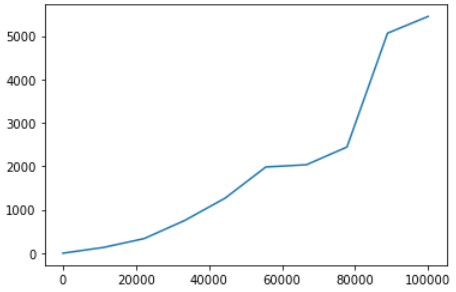

# Описание файлов

## main.py 

Реализованы функции чтения файла с числами, суммрования, умножения, поиска мниимума и максимума в массиве

## unit_test.py

Реализованы следующие юнит-тесты для функций файла main.py:
- Проверка корректности работы функции суммирования
- Проверка корректности работы функции умножения
- Проверка корректности работы функции нахождения минимума
- Проверка корректности работы функции нахождения максимума
- Проверка вывода функции нахождения минимума на принадлежность классу INT

## time_test.py

Реализовано построение графика зависимости времени выполнения функций от количества чисел в массиве

# Status badge

